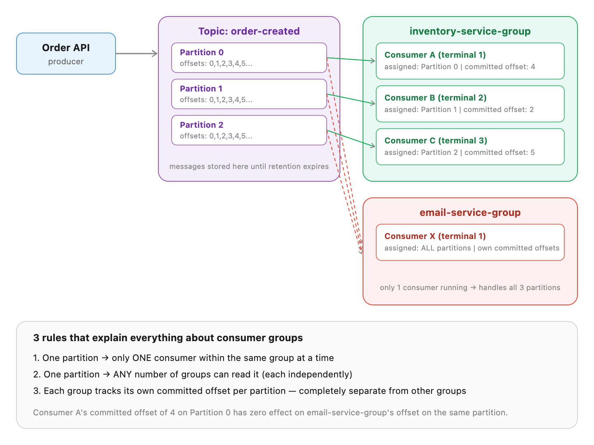

# Kafka + Go Learning Project

This project is structured to teach Kafka step by step. Go through the
folders in this order:

1. `producer/`        - simplest possible producer
2. `consumer/`         - simplest possible consumer (manual partition, no group)
3. `consumergroup/`    - real-world pattern: consumer group + manual commit
4. `order-system/`     - realistic mini microservice system tying it all together

---

## Prerequisites

- Go 1.22+ installed (https://go.dev/dl/)
- Docker + Docker Compose installed

---

## Step 1: Start Kafka locally

From the project root (where `docker-compose.yml` lives):

```bash
docker-compose up -d
```

This starts:
- Kafka broker on `localhost:9092`
- Kafka UI dashboard on `http://localhost:8080` (open this in your browser -
  you can visually watch topics/partitions/messages as you run the code below)

Check it's running:
```bash
docker ps
```

---

## Step 2: Run the basic producer + consumer

Open 2 terminals.

**Terminal A (consumer) - run this FIRST so it's ready to receive:**
```bash
cd consumer
go mod init kafka-demo-consumer   # only needed once
go get github.com/segmentio/kafka-go
go run main.go
```

**Terminal B (producer):**
```bash
cd producer
go mod init kafka-demo-producer   # only needed once
go get github.com/segmentio/kafka-go
go run main.go
```

You should see the consumer print each message as the producer sends it.

---

## Step 3: Try the Consumer Group version

```bash
cd consumergroup
go mod init kafka-demo-consumergroup
go get github.com/segmentio/kafka-go
go run main.go
```

**Experiment to really understand consumer groups:**
Run this SAME program in 2 separate terminals at once (same GroupID).
Then run the producer again. Watch how the 2 instances split the messages
between them (if your topic has multiple partitions) instead of both
getting every message. Open the Kafka UI to see partition assignment live.

To increase partitions for this experiment:
```bash
docker exec -it kafka /opt/kafka/bin/kafka-topics.sh \
  --alter --topic order-created --partitions 3 \
  --bootstrap-server localhost:9092
```

---

## Step 4: Run the full Order System example

This is the "realistic" example: one producer (Order API), two independent
consumers (Inventory + Email) in separate consumer groups.

```bash
cd order-system
go mod tidy   # downloads kafka-go based on go.mod
```

Open 3 terminals, run each of these (order doesn't matter, but starting
consumers first means you'll see them react in real time):

```bash
# Terminal 1
cd order-system/inventory-service
go run main.go

# Terminal 2
cd order-system/email-service
go run main.go

# Terminal 3 (run this last, after the consumers are listening)
cd order-system/order-api
go run main.go
```

**What to observe:**
- Both Inventory and Email services receive EVERY order (they're in
  different consumer groups).
- order-1001 and order-1003 (same CustomerID "cust-A") always land on the
  same partition, because we keyed messages by CustomerID.

---

## Things to try next (to deepen understanding)

1. Stop a consumer mid-way through processing (Ctrl+C), restart it, and
   notice it resumes from where it left off (not from the start) - this
   is offset commit at work.
2. In `inventory-service`, force `processOrderEvent` to return an error
   for a specific order, and watch the message get redelivered forever
   (this teaches you why you need retry limits + dead letter queues in
   real systems).
3. Use Kafka UI (localhost:8080) to manually inspect topic partitions,
   consumer group lag, and message contents.
4. Increase partitions and run 3 copies of `consumergroup` to see Kafka's
   automatic partition rebalancing in action.

